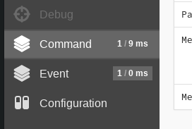
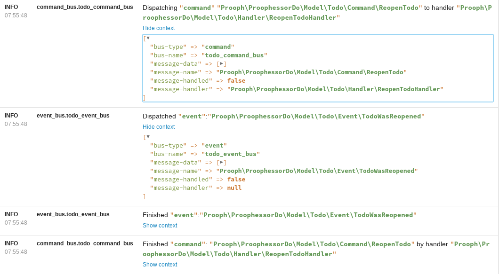
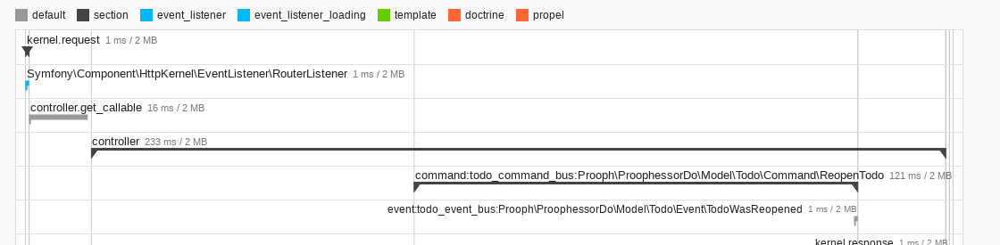

# Symfony Profiler

The ProophServiceBusBundle provides several plugins that help you to inspect your application.
For most of them you will need access to the Symfony Profiler, so please ensure that you have installed the
[WebProfilerBundle](https://packagist.org/packages/symfony/web-profiler-bundle).

## Plugins

### DataCollectorPlugin

The DataCollectorPlugin gathers data about the dispatched messages and shows them in an extra section within
the Symfony Profiler.
There is one profiler for the command- and one for the event-buses
and both are automatically enabled if `kernel.debug` is `true` and `symfony/stopwatch` is installed.



### PsrLoggerPlugin

The PsrLoggerPlugin fills your log with information about your dispatched messages.
There will be one PsrLoggerPlugin automatically registered for each defined message bus.

You can find the logged messages either in the *Logs* section of the Symfony Profiler or directly in your log
(depending on how your logging is configured).



### StopwatchPlugin

The StopwatchPlugin is automatically enabled if `kernel.debug` is `true`
(which is the case e.g. in the `dev` environment) and `symfony/framework-bundle` is installed.
It times the execution time of your command- and event-handlers.
The collected data are shown within the *Performance* section of the Symfony Profiler.

For an example with a executed command and an executed event please have a look at the following image:



## Message converter

The `DataCollectorPlugin` and the `PsrLoggerPlugin` need to extract some data from your domain messages.
By default they use the `Prooph\Common\Messaging\NoOpMessageConverter` to convert your messages into an array.
This will work optimally for messages that extend `Prooph\Common\Messaging\DomainMessage`.
Other messages will provide less data. 
So if this is the case and you want more data shown, you can customize the conversion.

### Possibility 1: Messages implement `Prooph\Common\Messaging\Message`

If your messages implement `Prooph\Common\Messaging\Message` you can exchange the message converter.
For an example you might want to have a look at the [`Prooph\Common\Messaging\NoOpMessageConverter`](https://github.com/prooph/common/blob/master/src/Messaging/NoOpMessageConverter.php).
Implement your own message converter focused on your messages and then configure it for each bus as shown below:

```yaml
# app/config/config.yml or (flex) config/packages/prooph_service_bus.yaml
prooph_service_bus:
    command_buses:
        acme_command_bus:
            message_converter: '@my_message_converter'
```
 

### Possibility 2: Messages do not implement `Prooph\Common\Messaging\Message`

In case your messages do not implement `Prooph\Common\Messaging\Message` exchanging the message converter want be useful,
because the message converter only acts on instances of `Prooph\Common\Messaging\Message`.
For this use case there is a special interface `Prooph\Bundle\ServiceBus\MessageContext\MessageDataConverter`
that is less strict about the type of the message.
You can implement your own message data converter and configure it for each bus as shown below:

```yaml
# app/config/config.yml or (flex) config/packages/prooph_service_bus.yaml
prooph_service_bus:
    command_buses:
        acme_command_bus:
            message_data_converter: '@my_message_data_converter'
```
